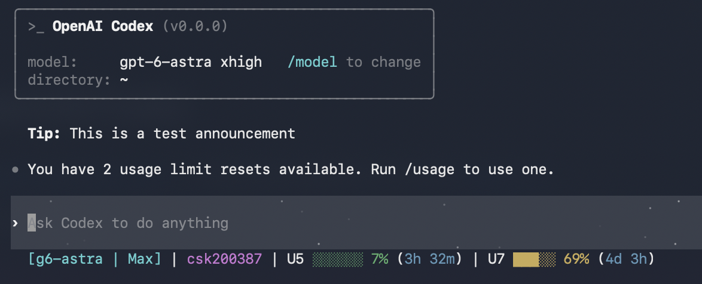

# Codex HUD (macOS Fork)

> **⚠ Archived.** Codex CLI's built-in `[tui] status_line` is enough of
> a substitute for what this project provided, so patching and building
> Codex from source is no longer necessary. Check `[tui] status_line` in
> your `~/.codex/config.toml` first. This repo is kept only for reference
> and is no longer maintained.

_Last verified against openai/codex: 2026-09 (stable release rust-v0.154.0)_

A macOS-compatible fork of [anhannin/codex-hud](https://github.com/anhannin/codex-hud) — a real-time status line HUD for [Codex CLI](https://github.com/openai/codex).



## What It Does
- Parses Codex rollout logs (`~/.codex/sessions/**/rollout-*.jsonl`)
- Shows current model, project, and Git branch state
- Displays 5-hour and 7-day usage bars with remaining reset time
- Uses Spark limits when the active model is `spark`, otherwise uses default limits

## Quick Start
```bash
git clone https://github.com/csk200387/codex-HUD.git
cd codex-HUD/Codex-HUD
./install.sh
```

## Supported Environment
- Target: HUD harness for Codex CLI on macOS and Linux
- OS: macOS (Apple Silicon / Intel), Linux (Ubuntu/Debian, Fedora/RHEL, Arch, openSUSE)
- Shell: bash, zsh
- Runtime: Node.js + npm, Rust toolchain (`cargo`)
- macOS prerequisites: Xcode Command Line Tools (`xcode-select --install`)
- Package managers auto-detected by installer: `apt-get`, `dnf`, `pacman`, `zypper`
- Not a primary target: native Windows

`install.sh` automatically:
- Builds the HUD (`npm ci`, `npm run build`)
- Applies the Codex source patch and builds patched `codex`
- Installs patched binary to `~/.local/bin/codex`
- Configures `~/.codex/config.toml` with `status_line_command`

On macOS, the first `cargo build --release` can take several minutes.

## Apply in Current Terminal
Changes do not appear in already-running Codex sessions.

1. Exit the current Codex session
2. Start Codex again
3. Check the HUD in the bottom status line

Verification commands:
```bash
grep -n "status_line_command" ~/.codex/config.toml
node dist/index.js --status-line --once --no-clear
```

## Commands
```bash
npm run build      # Build TypeScript output
npm run dev        # Build in watch mode
npm test           # Build + run Node tests
```

## Release / Deployment
Minimum pre-release checklist:
1. Run local verification: `npm test`
2. Validate install on a fresh terminal: `./install.sh`
3. Confirm runtime behavior: `codex --version` and HUD output
4. Push commit/tag and update GitHub release notes

Quick install for users:
```bash
git clone https://github.com/csk200387/codex-HUD.git
cd codex-HUD/Codex-HUD
./install.sh
```

## Color Control
```bash
NO_COLOR=1 codex                 # Disable HUD colors
FORCE_COLOR=1 codex              # Force-enable HUD colors
FORCE_COLOR=0 codex              # Force-disable HUD colors
```

## Example HUD Line
```text
HUD • g5.3c • Usage ██░░░░░░░░ 25% (1h 30m / 5h) | ████████░░ 80% (1d 3h / 7d)
```

## Troubleshooting
- HUD looks broken: reinstall latest build, then restart Codex session
- Install succeeded but HUD not shown: restart sessions launched before install
- HUD is easy to miss on macOS: it renders on the bottom row and may appear after the welcome screen redraw
- `tmux: command not found`: tmux mode is optional, not required

## Upstream
- Original project: [anhannin/codex-hud](https://github.com/anhannin/codex-hud)
- macOS fork (immediate parent of this repo): [Qifei-C/codex-HUD](https://github.com/Qifei-C/codex-HUD)
- Sync upstream: `git fetch upstream && git merge upstream/master`

## Support
- Bug reports: [github.com/csk200387/codex-HUD/issues](https://github.com/csk200387/codex-HUD/issues)
- Upstream issues: [github.com/anhannin/codex-hud/issues](https://github.com/anhannin/codex-hud/issues)

## Project Layout
- `src/`: HUD parser and renderer sources
- `dist/`: Build output
- `scripts/`: Install/patch/config scripts
- `patches/`: Codex TUI patch files
- `tests/`: Test files
- `docs/`: Analysis and design docs

## Promotion
- Launch copy templates: `docs/promo/launch-kit.md`
